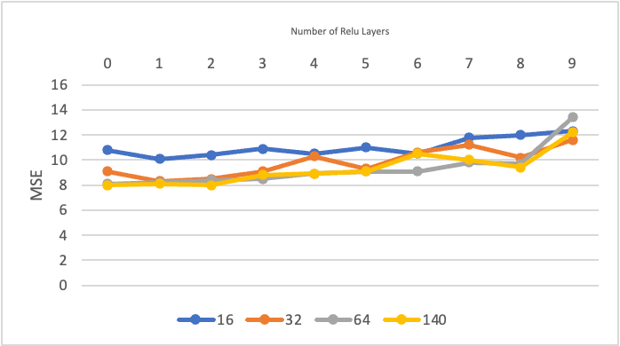
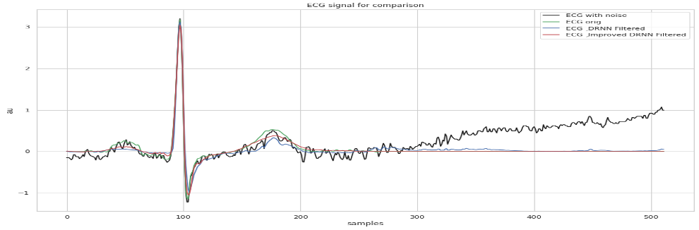
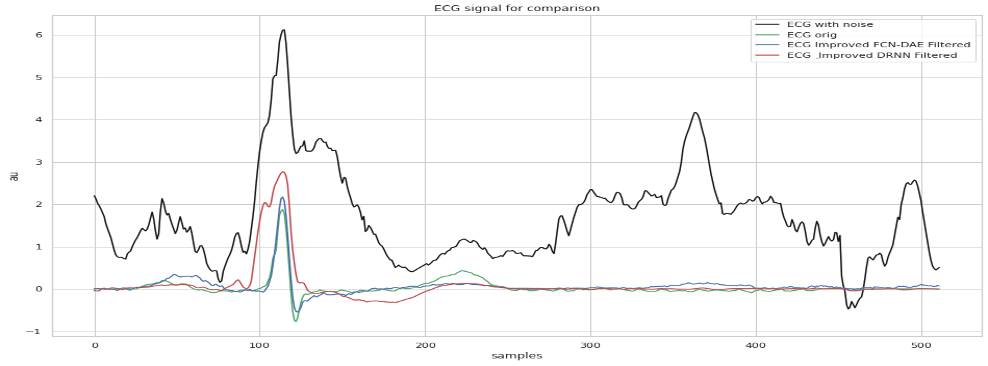
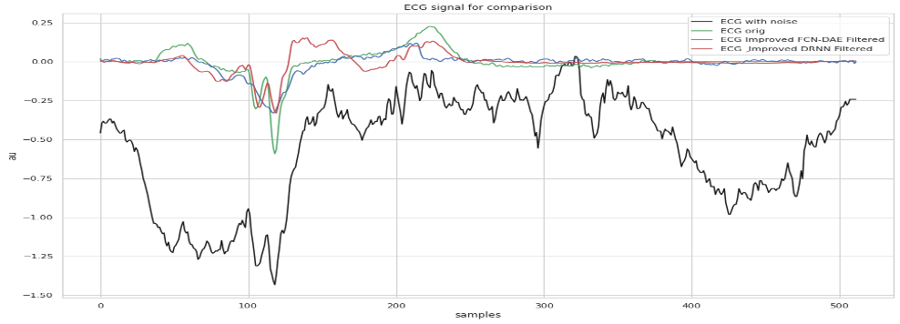

# Table of Contents

- [Introduction](#introduction)
- [Reference](#Reference)
- [Fully Convolutional Network](#Fully-Convolutional-Network)
- [Deep Recurrent Neural Network (DRNN)](#Deep-Recurrent-Neural-Network-(DRNN))
- [Data](#Data)
- [Experiments_Design](#Experiments design)
- [Evaluation_Metrics](#Evaluation Metrics)
- [Results](#results)

# Introduction

The electrocardiogram (ECG) is an efficient and noninvasive indicator for arrhythmia detection and prevention. In real-world scenarios, ECG signals are prone to be contaminated with various noises, which may lead to wrong interpretation. Therefore, significant attention has been paid on denoising of ECG for accurate diagnosis and analysis. A denoising autoencoder (DAE) can be applied to reconstruct the clean data from its noisy version.

# Reference 

FCN Article: https://ieeexplore.ieee.org/abstract/document/8693790
DRNN Article: https://www.researchgate.net/publication/326736103_Deep_Recurrent_Neural_Networks_for_ECG_Signal_Denoising
Language: Python 3.7
Packages: TensorFlow, Keras, Sci-kit learn, SciPy, Pandas, NumPy, RNN, LSTM.

# FULLY CONVOLUTIONAL NETWORK

FCN represents a distinct variant of CNN. CNNs typically comprise convolutional layers, activation functions, max-pooling layers, and a fully connected layer. The convolutional layers employ filters to generate feature maps describing input data characteristics. These layers share filter parameters among different feature maps, significantly reducing the overall parameter count when compared to the fully connected layer, where each neuron connects to all preceding layer outputs.

Pooling operations, with max-pooling being a common example, are utilized to achieve translation and rotation invariance, downsizing the feature maps by selecting the maximum values within specific regions. This reduction in dimensionality occurs. The fully connected layer's primary purpose is regression or classification.

The key distinction between FCN and CNN lies in the absence of the fully connected layer in FCN. By removing this layer, the parameter count is reduced, simplifying hardware implementation. Additionally, FCN allows each output sample to retain local spatial information from neighboring input regions, a characteristic not effectively preserved by fully connected layers.

To ensure precise signal alignment between input and output, our FCN model omits pooling layers, which might lead to loss of detailed structural and textural information within the network.

## Deep recurrent neural network (DRNN)

The method based on recurrent networks was employed, following the paper's description. An LSTM module with 64 units was utilized, with the return_sequence parameter set to True to ensure the complete sequence is returned, maintaining the same shape as the input tensor. Following the LSTM, there are two fully connected layers (Dense layers), each comprising 64 neurons and utilizing the ReLU activation function. The final layer consists of a single neuron in a Dense layer with a linear activation function. The chosen loss function is MSE, consistent with the original paper.

on the preprocessed data from the previous stage, networks of various sizes were evaluated to identify the one with optimal performance while maintaining suitability for large-scale training. To achieve this, two parameters were subject to analysis: "width" (the number of neurons/units in each layer) and "depth" (the number of ReLU layers in the network). By introducing two LSTM layers with 140 neurons in each layer and a ReLU layer between them, the objective is to extend the network with multiple ReLU layers, ranging from 0 to 9, and conduct training with 16, 32, 64, and 140 neurons in each layer.

## Data

All the experiments performed used the QT Database from Physionet. This dataset contains real ECG records that represent a wide range of QRS and ST-T morphologies in all the possible variability. It is composed of 105 ECG signals with 15-min and two channels each one sampled at 250 Hz. The experiments performed used all the records available in this dataset. In order to add real baseline drifts to the QT database, real BLW signals from the MIT-BIH Noise Stress Test Database (NSTDB) were used. The database contains 30 minutes of 12 ECG recordings and 3 recordings of typical noise in stress tests at 360 Hz sampling frequency. These noises are baseline wander produced by the patient’s breathing, muscle artifact and electrode motion artifact. The ECG records are randomly corrupted with the noise present in the three noise channels. The noise records were recorded during physical stress tests, with electrodes placed on the limbs in positions where ECG cannot be acquired.

# Experiments design

An experiment benchmark for BLW removal has been designed, facilitating the evaluation of various methods using an identical test set and consistent conditions. To accomplish this, all 105 signals from the QT Database were oversampled, increasing the frequency from 250 Hz to 360 Hz to match the NSTDB sampling rate. Heartbeats were subsequently extracted based on expert annotations. However, a minor issue with incorrect annotations occasionally caused the combination of consecutive beats. To address this, beats exceeding 512 samples (equivalent to 1422.22 ms) were filtered out.

For testing purposes, heartbeats from 14 signals (as detailed in Table 1) were selected to constitute a test set, representing 13% of the total number of signals. These signals were chosen from two signals in each of the seven datasets used to create the QT Database, ensuring diverse pathologies in the test set. This approach aids in assessing the generalization capabilities of the methods under evaluation.

To introduce noise into the ECG signals, the NSTDB's noise data, including BLW due to breathing and electrode movement (designated as "em" in the database), was utilized. The "em" record was split to match the length of the beat samples, and channels 1 and 2 were concatenated, while preserving 13% of each channel's signal length to contaminate the signals designated for the test set.

Having a separate test set for signals ensures the reliability of the results when employing learning algorithms and prevents any potential advantages over classical methods. When injecting noise, the same procedure as the NSTDB was followed, randomly introducing values ranging from 0.2 to twice the maximum peak value of the ECG signal.

# Evaluation Metrics

According to studies published in, distance-based metrics are considered the most suitable for evaluating signal similarity. To assess the methods' performance in minimizing distortion on ECG signal morphology when removing BLW, the following metrics were employed: Absolute maximum distance (MAD), sum of the square of distances (SSD), percentage root-mean-square difference (PRD), and Cosine Similarity.

## Results

The results show that the fully convolutional network based on autoencoder noise removal has better performance in all evaluation criteria compared to the advanced deep recurrent neural network noise removal. It seems that eliminating this noise and recovering the original signal has been challenging for both networks, especially the advanced deep recurrent neural network noise removal. However, the fully convolutional network based on autoencoder noise removal performs better. Motion artifacts are patternless due to electrode movement with irregular body motions. Therefore, finding the pattern of the interfering noise, especially in signals with anomalies, may not be easily eliminated by the network.

### Run on Google Colab

The simplest way to reproduce results is by using the Google Colab notebook. The notebook file displays 
all cells results from a previous run.
The used Google Colab GPU environment will allow GPU acceleration when training the deep learning models.     
The code will automatically download the data from Pysionet servers and prepare it to be used. Then the different deep 
learning methods will be train. Finally all the results will be computed using the metrics and printed as a table. Due 
the randomness proper of this method the results may differ slightly with the published results.
  
  
